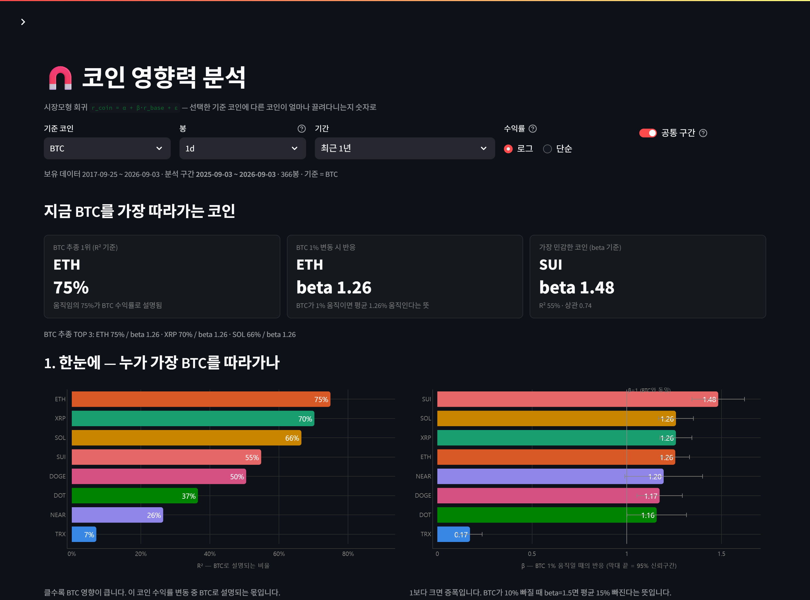
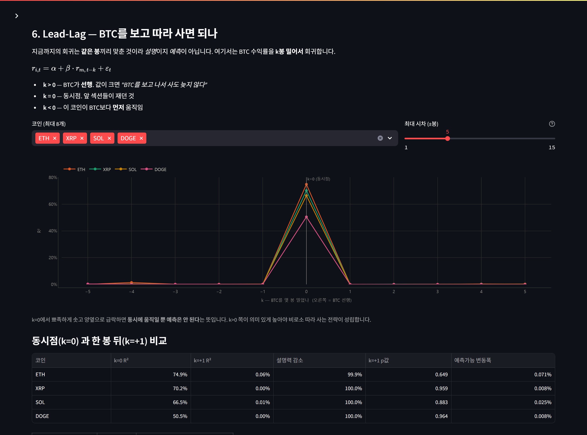

# 코인 영향력 분석

> 시장모형 회귀로 **"이 코인이 기준 코인에 얼마나 끌려다니는가"** 를 숫자로 측정하는 대시보드.


<p align="center">
  
</p>
<p align="center">
  <sub>기준 코인을 BTC로 놓았을 때 — ETH는 움직임의 75%가 BTC로 설명되고, SUI는 β 1.48로 가장 크게 증폭된다.</sub>
</p>

---

## 무엇을 재는가

$$r_{i,t} = \alpha + \beta \cdot r_{m,t} + \varepsilon_t$$

기준 코인(시장) 수익률에 개별 코인을 회귀시켜 네 가지로 분해합니다.
주식에서의 **CAPM 베타**와 같은 식이고, $r_m$ 자리에 무엇을 넣느냐만 다릅니다.

| 기호 | 의미 | 읽는 법 |
|:---:|:---|:---|
| **β** | 민감도 | 기준 코인이 1% 움직일 때의 반응 폭 |
| **R²** | 설명력 | 이 코인 움직임 중 기준 코인으로 설명되는 비율 |
| **α** | 초과수익 | 기준 코인으로 설명되지 않는 고유 수익 (연율) |
| **σ_ε** | 고유 변동성 | 기준 코인을 제거하고 남은 몫 — 분산투자로 줄일 수 있는 부분 |

**β와 R²는 서로 독립입니다.** 크게 반응하는 것(β)과 충실하게 따라가는 것(R²)은 다른 질문이고,
포트폴리오를 짤 때 실제로 중요한 건 후자입니다.

---

## 화면 구성

| | 내용 |
|:---|:---|
| **1. 한눈에** | 전 코인 R² · β 순위 막대 (β는 95% 신뢰구간 오차막대, β=1 기준선) |
| **2. 코인 하나 파고들기** | 지표 5종 + 산점도·회귀선 + 자동 해석 표 |
| **3. 롤링 회귀** | β·R²가 시간에 따라 얼마나 불안정한지 |
| **4. 상관행렬** | 기준 코인 말고 자기들끼리는 어떤지 (발산형 히트맵) |
| **5. 전체 수치** | 표준오차·p값 포함 전체 표 + CSV 내려받기 |
| **6. Lead-Lag** | 기준 자산을 k봉 밀어서 회귀 — 설명인지 예측인지 가르는 곳 |

기준 코인은 **BTC / ETH / SOL / XRP** 중에서 고를 수 있고, 기간·봉·수익률 방식도 바꿀 수 있습니다.

---

## 통계적으로 챙긴 것

- **β=1 검정** — "증폭된다"는 말이 통계적으로 유의한지 별도 p값으로 판정
- **α 유의성** — 값이 커 보여도 p값이 유의하지 않으면 화면에 그렇게 표시. 숫자만 보고 착각하지 않게
- **신뢰구간** — 점추정 옆에 항상 95% CI
- **공통 구간 정렬** — 상장일이 다른 코인을 같은 기간으로 맞춰 비교 (끌 수도 있음)
- **분산분해 검증** — 총분산 = β²·Var(기준) + 잔차분산 이 소수 5자리까지 일치함을 확인

`statsmodels` 없이 OLS를 직접 계산합니다 (`app.py` 의 `market_model`).

---

## 실행

```bash
pip install -r requirements.txt
streamlit run app.py
```

http://localhost:8501 에서 열립니다.

---

## 데이터

**Upbit KRW 마켓 9개 코인** — BTC · ETH · XRP · SOL · DOGE · DOT · NEAR · SUI · TRX

| | 동봉 여부 | 이유 |
|:---|:---:|:---|
| **일봉 (1d)** | ✅ 포함 (1.1MB) | 첫 화면을 API 상태와 무관하게 보장 |
| 시간봉 (1h) 외 | ❌ 제외 | parquet은 바이너리라 갱신할 때마다 21MB가 히스토리에 통째로 쌓임 |

동봉되지 않은 타임프레임은 실행 시 Upbit API로 받아옵니다.
다만 Upbit이 해외 IP를 차단하는 경우가 있어, 클라우드 배포 환경에서는 실패할 수 있습니다.
그때는 앱이 안내를 띄우고 일봉으로 돌아가도록 되어 있습니다.

> 동봉 데이터는 **2026-09-03 기준 스냅샷**입니다. 앱 상단에 분석 구간이 항상 표시됩니다.

---

## 읽을 때 주의할 것

**1. β와 R²는 고정값이 아닙니다.** 구간을 바꾸면 숫자가 달라집니다. 롤링 차트가 그 불안정성을 보여줍니다.

**2. R²가 높다 ≠ 인과관계.** 회귀는 상관을 잰 것입니다. 다만 *"기준 코인 포지션과 리스크가 겹친다"* 는 판단에는 이걸로 충분합니다.

**3. 상관은 폭락장에서 1로 수렴합니다.** 평시 R²를 믿고 분산했는데 정작 크게 빠지는 날엔 전부 같이 빠집니다.

**4. 같은 봉 회귀는 예측이 아닙니다.** *같은 시점*의 두 수익률을 맞추는 것이라 설명이지 예측이 아닙니다.
6번 섹션이 이걸 실측으로 보여줍니다 — 기준 코인을 **한 봉만 밀어도** 설명력이 사라집니다.

<p align="center">
  
</p>

| 코인 | k=0 R² | k=+1 R² | 설명력 감소 | k=+1 p값 |
|:---|---:|---:|---:|---:|
| ETH | 74.9% | **0.06%** | **99.9%** | 0.649 |
| XRP | 70.2% | 0.00% | 100.0% | 0.959 |
| SOL | 66.5% | 0.01% | 100.0% | 0.883 |
| DOGE | 50.5% | 0.00% | 100.0% | 0.964 |

<sub>일봉·최근 1년·기준 BTC. p값이 전부 0.6 이상 — 남은 설명력은 0과 구분되지 않습니다.</sub>

이론적으로 잡을 수 있는 한 봉당 움직임은 최대 **0.071%** 로, 업비트 왕복 수수료 **0.10%** 보다 작습니다.
통계적으로 유의하더라도 매매하면 수수료에 먹힙니다.

**5. 관측 주기가 결과를 바꿉니다.** 주기를 짧게 자를수록 측정되는 상관이 깎여 나갑니다(Epps effect). 같은 코인이 일봉 R² 58%, 시간봉 50%로 나옵니다.

---

## 구조

```
app.py            대시보드 본체 (UI + 회귀 계산)
core/
├── config.py     코인·타임프레임·경로 설정
└── data.py       parquet 로딩 + Upbit API 폴백
data/ohlcv/       일봉 parquet (코인별)
```

---

<sub>학습·연구 목적입니다. 투자 조언이 아니며 어떤 수익도 보장하지 않습니다.</sub>
